# Extruder upgrade

Upgrading the extruder eases filament removal avoiding filament getting stuck.

* [MK7 MK8 Extruder Feeder](https://www.amazon.es/gp/product/B019HNCVWU/ref=oh_aui_detailpage_o00_s00?ie=UTF8&psc=1)
* [Extruder upgrade video (Spanish)](https://www.youtube.com/watch?v=-1MQKHL1RrU)

## Changing the extruder main board connector

When choosing the extruder verify if the connector is a three-pin connector or a two-pin connector. Anet A8 uses the three-pin connector:

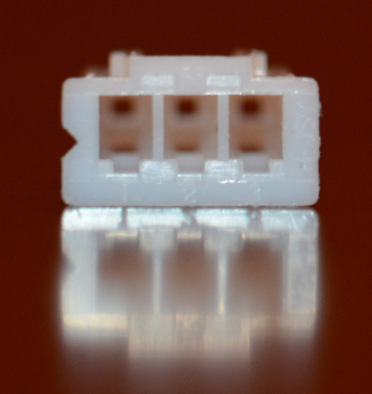

If your extruder has a 2-pin connector:

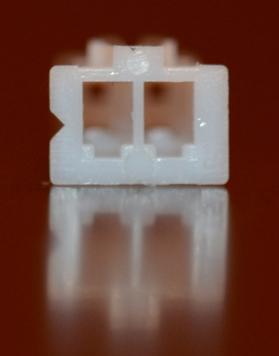

You will need to remove the 2-pin connector:

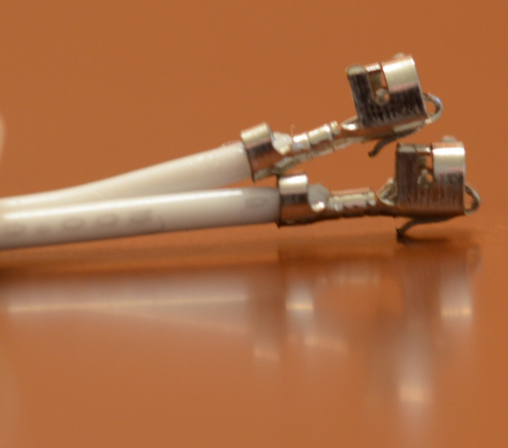

You can use a female-to-male ends connector wire cable to connect it to the mainboard:

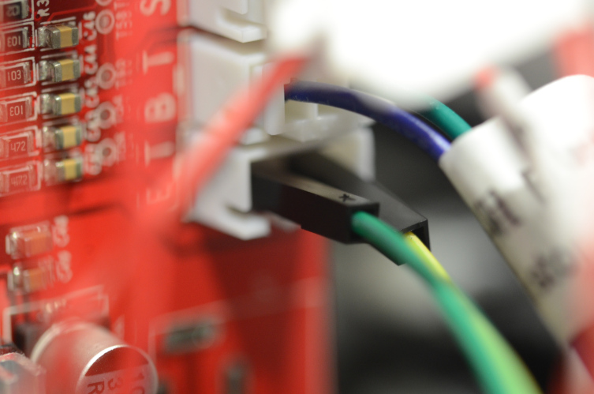
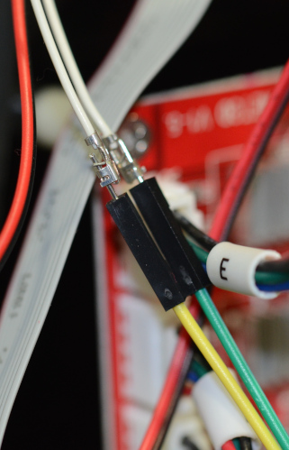

## Mounting the extruder feeder

Dismantle the extruder, the whole thing:

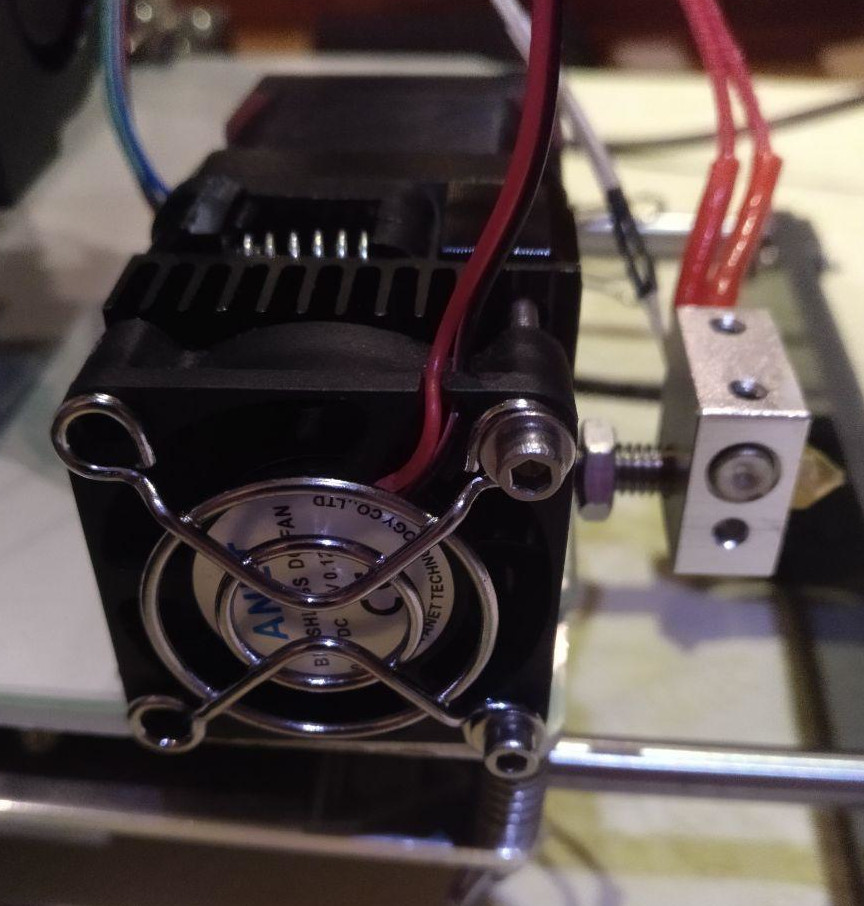 

Dismantle the fan, unscrew it and mount the new extruder feeder:

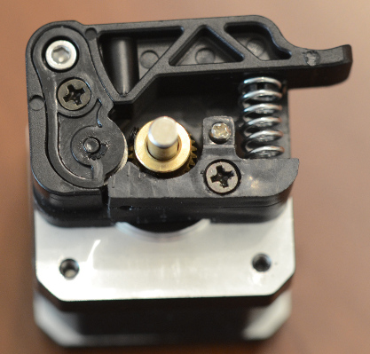 

You will need to cut it a bit:

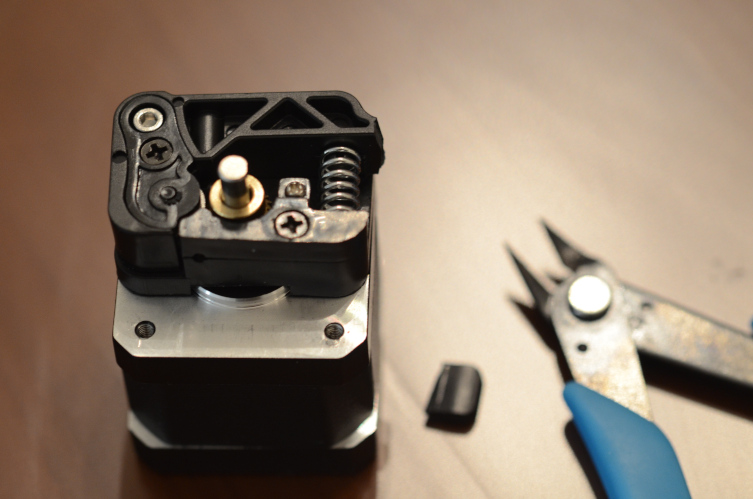

> May you have to sand the extruder feed to be certain than it tightens wel with the metal piece.

Here you will have to adjust this screw to be able to push the extruder feeder down to introduce PLA/ABS filament:

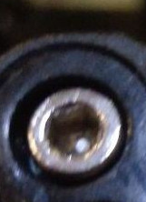

You need to be able to push it:

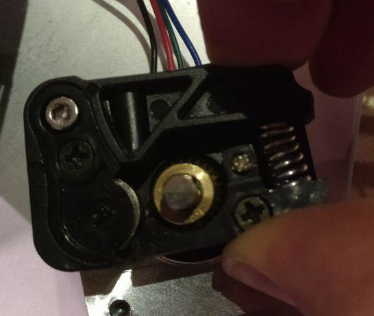

Align the gold barrel to PLA/ABS flows by the center of the barrel:

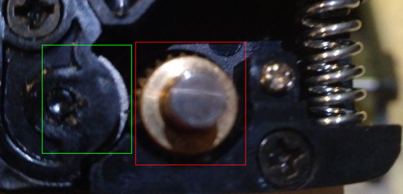

> If this is not properly aligned the printing will be irregular showing "empty spaces".

Mount the extruder and be certain that extruder is properly aligned with the filament hole. You can use a 1,5 allen key:

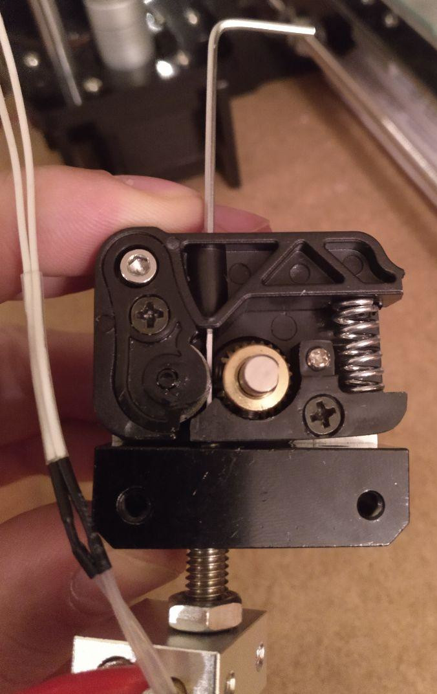

Screw the fan and mount the whole piece:

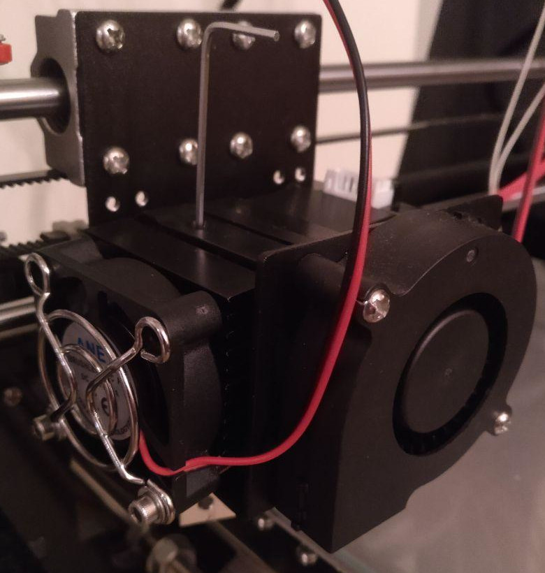

Now you can remove the allen key:

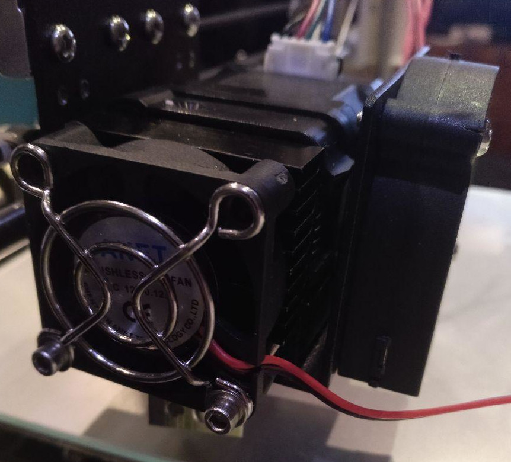

