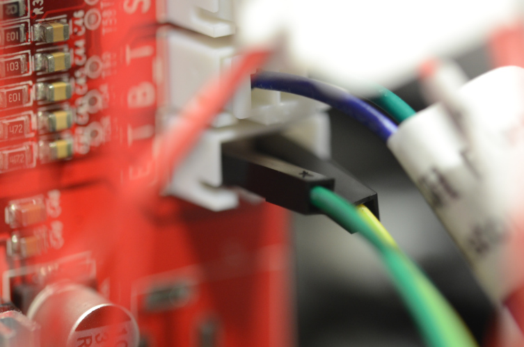

# Anet A8 improvements

## Extruder upgrade

Upgrading the extruder eases filament removal avoiding filament getting stuck.

* [MK7 MK8 Extruder](https://www.amazon.es/gp/product/B019HNCVWU/ref=oh_aui_detailpage_o00_s00?ie=UTF8&psc=1)
* [Extruder upgrade video (Spanish)](https://www.youtube.com/watch?v=-1MQKHL1RrU)

When choosing the extruder verify if the connector is a three-pin connector or a two-pin connector. Anet A8 uses the three-pin connector:

If your extruder has a 2-pin connector:

You will need to remove the 2-pin connector:

You can use a female-to-male ends connector wire cable to connect it to the mainboard:

After mounting it on the motor engine:

You will need to cut it a bit:

## MOSFET for hotbed

[MOSFET for hotbed](https://www.amazon.es/gp/product/B076M7CK1N/ref=oh_aui_detailpage_o09_s00?ie=UTF8&psc=1)

## Power switch

[Power switch](https://www.amazon.es/gp/product/B00FFY3Q0C/ref=oh_aui_detailpage_o00_s00?ie=UTF8&psc=1)

## Wheel bearing

[Wheel bearing](https://www.amazon.es/gp/product/B01N6BFM6Y/ref=oh_aui_detailpage_o03_s00?ie=UTF8&psc=1)

## Spool Holder Redux

[Anet A8 Spool Holder Redux](https://www.thingiverse.com/thing:1743397)

## T corner

To reduce z-wobble.

[Anet A8 T corner](https://www.thingiverse.com/thing:1672959)
