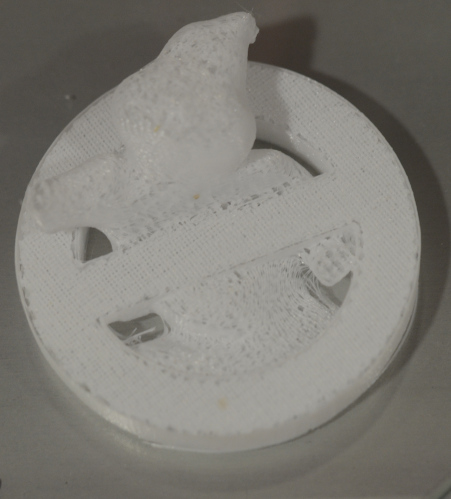

# Extruder troubleshooting

## Manually moving the extruder

Do not forze the extruder. If you need to move it:

+ Go to **Quick Settings -> Home All**.
+ After the extruder finished to move go to **Quick Settings -> Disable Stepper**.
+ You can go back to the main display to verify that stepper is disabled. Now you can manually move the extruder.

## Non uniform printing (MK8 extruder assembly)

Check that extruder is well assembled or your printings could be that way:

If extruder is not well assembled extruder could look like this:

* [Changing extruder (English)](https://www.youtube.com/watch?v=B71GGLBrQDU)
* [Changing extruder (Spanish)](https://www.youtube.com/watch?v=0cFLUJPHaJk)

Other problem you can have:

## Filament get stuck into the extruder

Sometimes PLA/ABS filament can get stuck into the extruder. To avoid that introduce/extract the filament when the extruder is hot. But sometimes ....

If the filament proyects:

You can use pillers to extract all the filament or just a part of it:

If filament does not project or you can not remove all the filament:

You could use a 1,2 dremel drill to "remove" the stuck filament (use low revolution) 

You will have removed most of the filament. Mount the extruder, warm the extruder (Extruder -> Temperature and set temperature to 230). When temperature get 230 Celsius degrees use the 1,5 allen key. Introduce it in the extruder feeder pushing smoothly until PLA/ABS filament leaks:

