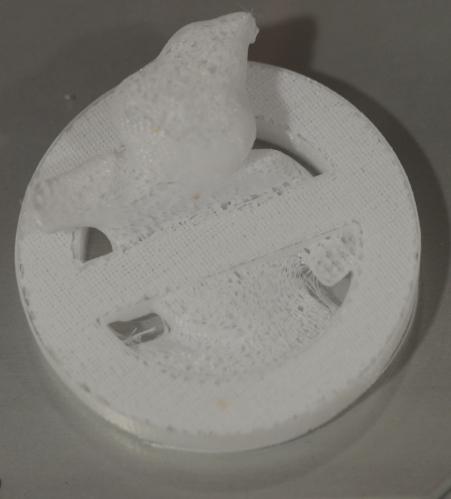
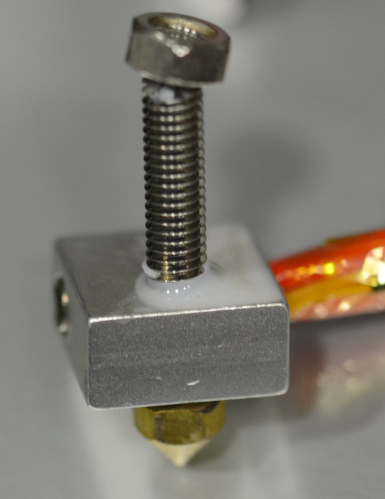

# Extruder

## MK8 extruder assembly

Check that extruder is well assembled or your printings could be that way:

If extruder is not well assembled extruder could look like this:

* [Changing extruder (English)](https://www.youtube.com/watch?v=B71GGLBrQDU)
* [Changing extruder (Spanish)](https://www.youtube.com/watch?v=0cFLUJPHaJk)
