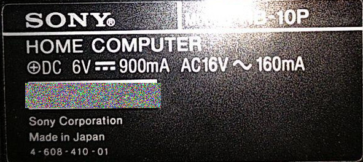
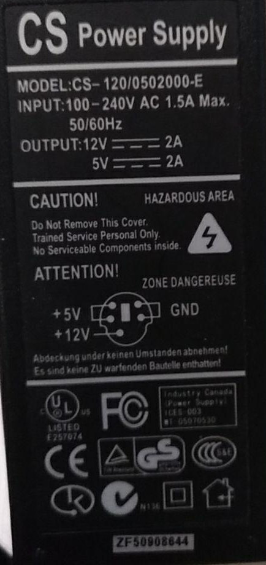

# Power Supply for Sony Hit Bit HB-10P (MSX)

## Information about the computer

+ Information about this computer can be found in [www.msx.org](https://www.msx.org/wiki/Sony_HB-10P).

+ The power supply is [Sony AC-HB1P](https://www.msx.org/wiki/Sony_AC-HB1P).

+ [Service manual for Sony Hit Bit HB-10P](https://archive.org/details/sonyhb10p10bsm/mode/2up). Electrical scheme in 5-4.

## Information about some hacks

+ How to create a power supply for the [Sony HB-20P](http://fenris78.blogspot.com/2014/01/modificacion-alimentacion-msx-sony-hb.html) (Spanish).

+ How to create a more elaborated power supply for the [Sony HB-20P](https://www.va-de-retro.com/foros/viewtopic.php?t=6294) (Spanish).

+ [RetroChallengeRetry, 2020/04](https://www.raphnet.net/divers/retro_challenge_2020_04/index_en.php) with some information about the machine and the power supply.

+ [Service manual for Sony Hit Bit HB-10P](https://archive.org/details/sonyhb10p10bsm/mode/2up). Electrical scheme in 5-4.

## Information about the Power Supply

+ Not standard output plug.

+ From [RetroChallengeRetry, 2020/04](https://www.raphnet.net/divers/retro_challenge_2020_04/index_en.php):

> 
>    + 6V DC (900 mA): Sent to the 5V voltage regulator.
>    + 16V AC (160 mA): Used to make 12V and -12V DC using 7812 et 7912 voltage regulators.
>        + 12V: Sent to the cassette connector and to the cartridge slots.
>        + -12V: Sent to the cartridge slots.

From the computer itself:

## Recycling power supplies

+ One available power supply from a external IDE Disk. Could it be recycled?

